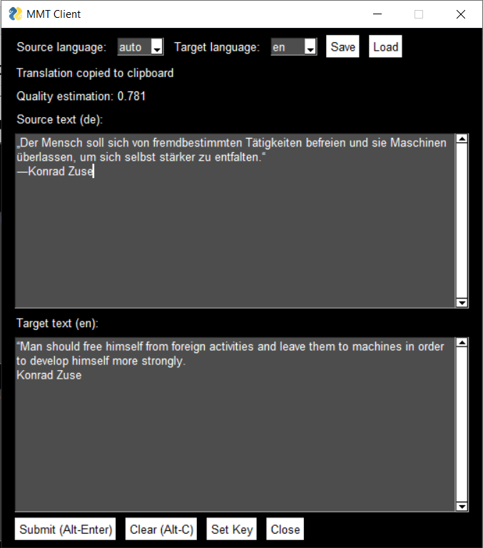

### GUI client for ModernMT machine translation API

Note: You will need a paid subscription from [https://www.modernmt.com]() for this tool to work.

API documentation by modernmt can be found here:
[https://www.modernmt.com/api/]()

There are countless machine translation services freely available, 
so why bother creating this tool?
As a technical translator I am using CAT tools and which integrate
machine translation services already. 
But for quick lookup of words, sentences, during work, this is a handy tool. 
Useful information: the window shows a quality estimation below each translation.

Your api key goes into a python file __key.py__ which contains only one line: 
`key = 'your-api-key'`

Language settings can be done in the GUI and are saved in _settings.json_ 
or you can edit the json file by hand of course, additional languages can be
added as well. I only use languages that are of interest for me.

As it is possible to upload your own translation memories to the ModernMT server, 
and utilize them, I will improve this tool in future and add functionality 
to utilize your own translation memories.

